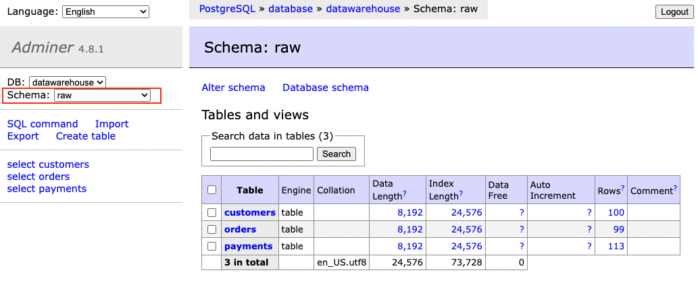

# Before workshop

1. Clone dbt demo project -> https://github.com/strvcom/dbt-workshop and navigate to `dbt-demo` folder, which contains following:
   * dbt project
   * postgres database
   * sample data from jaffle_shop (already loaded in postgres db)
     * tables: *customers*, *orders*, *payments*
   * sample google analytics events data with traffic (.csv file in seeds folder within dbt folder)
2. Make sure to have [Docker Desktop](https://www.docker.com/products/docker-desktop/) running on your machine.
3. Once you are in `dbt-demo` folder, run `docker-compose up` which will download all images needed and start three containers:
   1. `dbt-workshop-db` - postgres server as our data warehouse
   2. `dbt` - container where to run dbt command 
   3. `dbt-workshop-adminer` - container with adminer, simple SQL IDE available on [localhost:8080](http://localhost:8080)
4. Log into the adminer to confirm everything is running:
   1. System: `PostgreSQL`
   2. Server: `database`
   3. Username: `postgres`
   4. Password: `postgres`
   5. Database: `datawarehouse`
5. You should see the following screen:
   
6. Change `Schema` in the upper left corner to `raw` to see already loaded jaffle_shop data
   