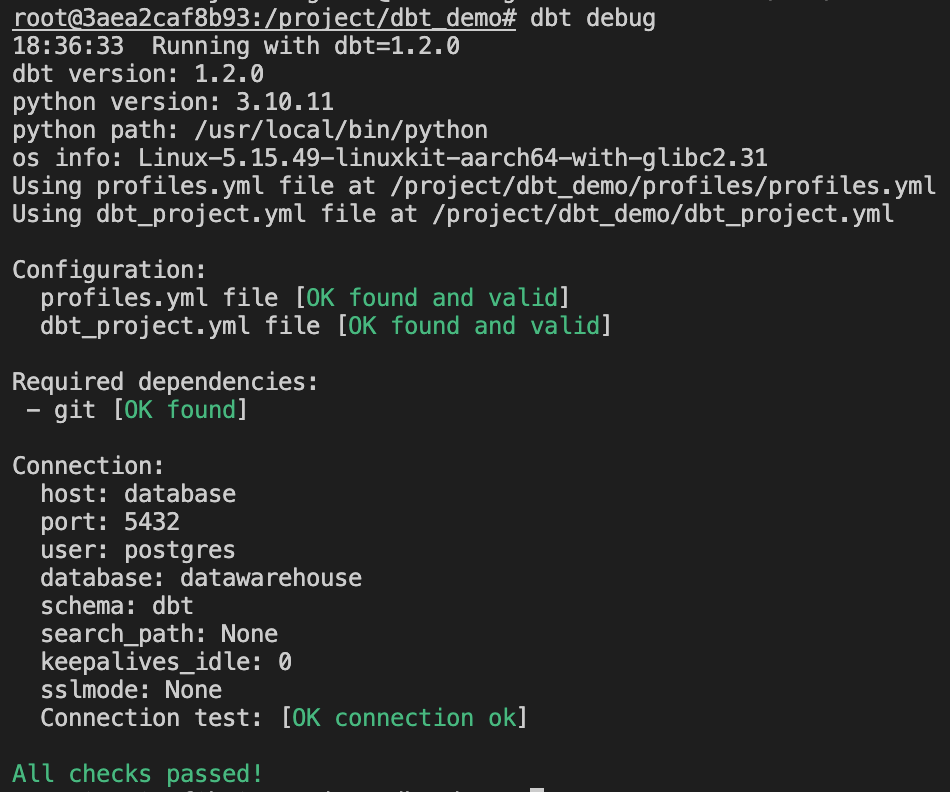

# Introduction to dbt

## What is dbt?

dbt is the T/transformation in ELT data pipelines. It runs on top of the database/data warehouse and creates DAGs for data transformations. It is `a combination of SQL and Jinja`, which is compiled into database-specific SQL that is run sequentially. Definitions happen in `YAML files` which also serve as a source for documentation. Additionally, dbt gives you testing capabilities so you can see which models = tables are causing trouble.

```{warning}
dbt community has clear consent that dbt should be written in lowercase. Please obey this agreement!
```

### How does dbt work?

dbt parses every file in folder transform. In SQL files, it looks for the jinja function source/ref to create dependencies. It then creates DAG how all tables are connected and starts by compiling these into pure SQL files. Compiled files can be found in the target/compiled folder or whatever is set in the `dbt_project.yml` file. Then it runs each model/table from the beginning to the end of the DAG.


## Exercise

Time to run our first dbt command

1. First, attach terminal to docker container with dbt
   ```bash
   docker exec -w /project/dbt_demo/ -it dbt-demo_dbt_1 /bin/bash
   OR
   docker exec -w /project/dbt_demo/ -it dbt-demo-dbt-1 /bin/bash
   ```
2. You are now in dbt container where you can execute `dbt` commands
3. Run `dbt debug`
4. You should see following:
   
