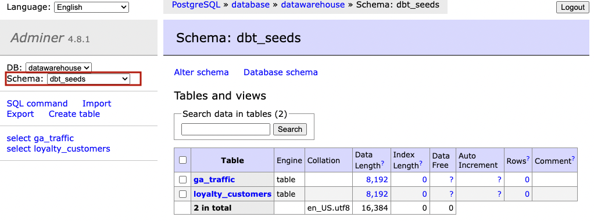

# Exercise
    
1. **Load data:** 
  - **Jaffle Shop data** : jaffle_shop data are already loaded in our postgres database: `orders`, `customers` and `payments`, so there is no action needed. 
  - **Google Analytics data** : traffic data are located in `ga_traffic.csv` file in *seeds* folder. 
      - Add this code snippet into `dbt_project.yml` file at the end. This will create `dbt_seeds` schema inside your database once you run `dbt seed` command.
        ```yaml
        seeds:
          +schema: seeds
        ```
      - Run `dbt seed --select ga_traffic` command in dbt docker container which will load these .csv files into our database. You can double check by looking into `dbt_seeds` schema in DB Adminer.

      
2. **Create source files**: create a source file `_src_[sourcename].yml` for each data source: *jaffle_shop* and *google_analytics* in their folders.
3. **Configure source files:** edit both `_src_[sourcename].yml` files according [to the example](../02/data_sources.md).
4. **Add tests:** Define `unique` test for `id` column in each jaffle_shop table and `date` column in ga_traffic table. 
5. **Test the solution**: Test the uniqueness by running `dbt test` command in dbt container.


## Solution


:::{admonition} `_src_jaffle_shop.yml`
:class: dropdown

```yaml
version: 2

sources:
  - name: jaffle_shop
    schema: raw
    tables:
      - name: orders
        columns:
          - name: id
            tests:
              - unique
      - name: customers
        columns: id
          - name: 
            tests:
              - unique
      - name: payments
        columns:
          - name: id
            tests:
              - unique
```
:::


:::{admonition} `_src_google_analytics.yml`
:class: dropdown

```yaml
version: 2

sources:
  - name: google_analytics
    schema: dbt_seeds
    tables:
      - name: ga_traffic
        columns:
          - name: date
            tests:
              - unique
```
:::
